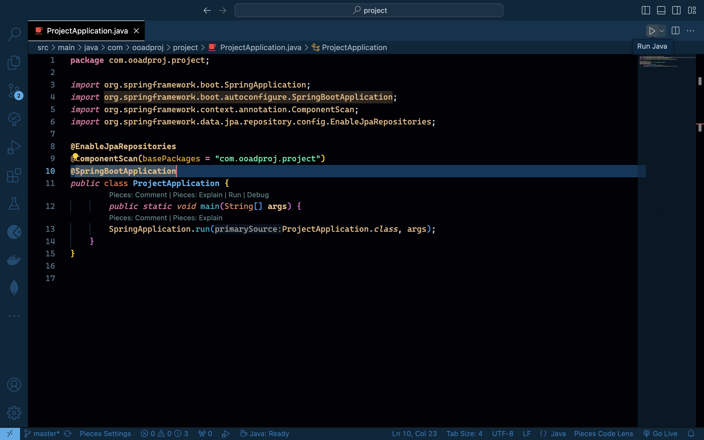
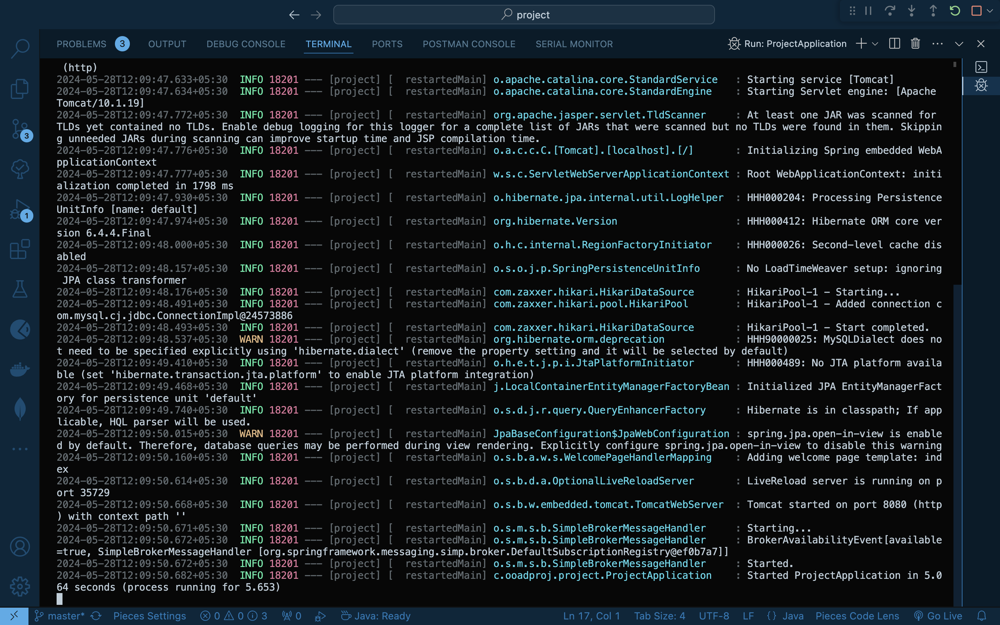

# Code Sharing and Discussion Platform

## Description of the Project
The Code Sharing and Discussion Platform is a comprehensive solution designed to enhance collaboration and knowledge exchange among developers. The platform provides a user-friendly interface for developers to create, edit, share, and discuss code in a secure and organized manner. Key features include user registration and authentication, code creation and editing, group collaboration, and code sharing among users. This project is implemented in Java, offering a robust and scalable solution for code sharing needs.

## Features
- **User Registration and Authentication**: Secure access through user registration and login.
- **Code Creation, Editing, and Sharing**: Create, edit, and share code files within the platform.
- **Group Creation and Collaboration**: Form groups to collaborate on projects and share code files and insights.
- **Code Sharing Among Users**: Share code files with individuals outside of groups to foster knowledge sharing.
- **Code Viewing**: View shared code files seamlessly within the platform.

## Installation Process
### Prerequisites
- Download the latest Java Development Kit version 
- Apache Maven
- MySQL Database
- IDE (e.g.VS code, IntelliJ IDEA, Eclipse)

### Steps
1. **Clone the Repository**
   ```bash
   git clone https://github.com/Nishanthrkashyap903/Code-Sharing-Discussion-Platform.git
   cd Code-Sharing-Discussion-Platform-master

2. **Configure Database**
- Go to `src/main/resources` directory 
- Change the `DatabaseName` by creating a new Database in mysql server , Change the `databaseUserName`  , `databasePassword`  in `application.properties.sample` 
- Rename the file `application.properties.sample` to `application.properties`  

3. **Run The Project**
- Go to `src/java/com/ooadproj/project` directory and open `ProjectApplication.java` file
- And Run the above file as shown in the screenshot 

- The project is running in `http://localhost:8080`

